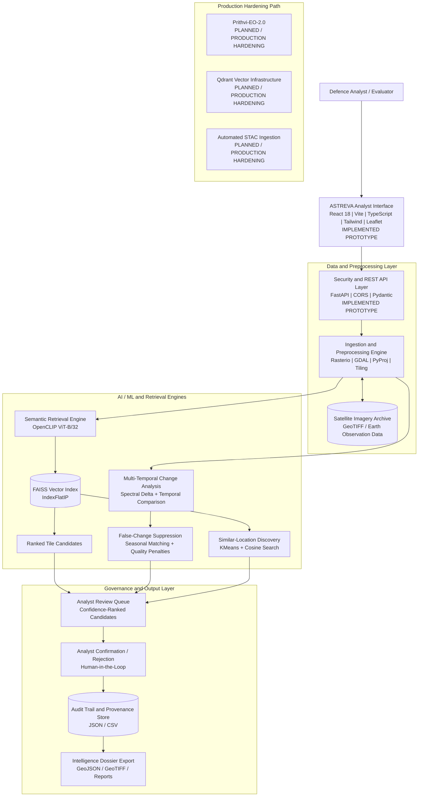
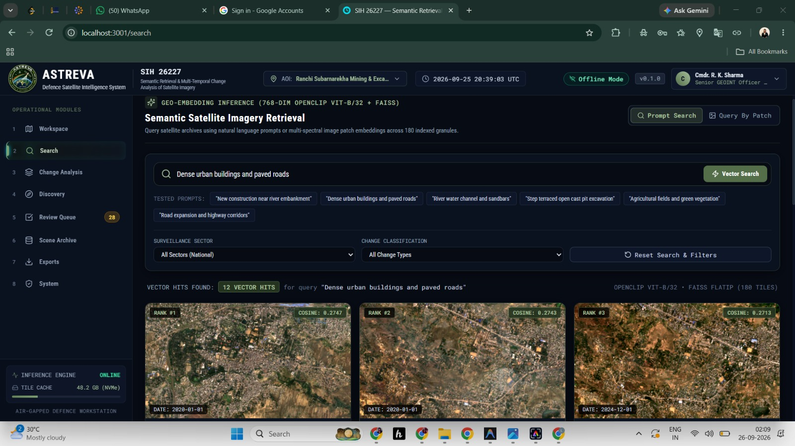

# ASTREVA: Defence Satellite Intelligence System

### Semantic Retrieval and Multi-Temporal Change Analysis of Satellite Imagery

[](https://www.sih.gov.in/)
[](#smart-india-hackathon-2026)
[](https://react.dev/)
[](https://www.typescriptlang.org/)
[](https://vitejs.dev/)
[](https://fastapi.tiangolo.com/)
[](https://pytorch.org/)
[](https://github.com/facebookresearch/faiss)
[](https://www.docker.com/)

**Smart India Hackathon 2026**  
**Problem Statement ID:** SIH26227  
**Organization:** Ministry of Defence — Directorate General of Information Systems (DGIS), Indian Army  
**Theme:** Space Technology  
**Category:** Software  
**Team:** Impacteers

---

## Executive Summary

ASTREVA is a defence-oriented satellite intelligence platform for semantic retrieval and multi-temporal analysis of Earth observation imagery. Developed as an engineering prototype for Smart India Hackathon 2026 under problem statement SIH26227, the platform addresses the operational limitations of conventional geospatial archive retrieval systems.

Traditional Earth observation workflows commonly depend on scalar metadata such as geographic bounding boxes, acquisition timestamps, and sensor identities. ASTREVA introduces multi-modal vector search and temporal change inference, allowing imagery analysts to search satellite catalogues using semantic descriptions and trace structural and physical changes over multi-year observation intervals.

> **Operational Concept:** *"Describe what you seek. Trace what changed."*

---

## Operational Workflow

ASTREVA operates across a five-stage intelligence sequence:

**DISCOVER → RETRIEVE → TRACE → VERIFY → ACT**

1. **Discover** — Define surveillance sectors, monitor regional Areas of Interest (AOIs), or identify terrain groupings through representation clustering.
2. **Retrieve** — Formulate natural-language descriptions or provide reference image patches to retrieve top-ranked relevant satellite tiles using cross-modal vector similarity.
3. **Trace** — Perform multi-temporal evaluation between historical baseline passes and recent acquisitions to identify spectral and morphological differences.
4. **Verify** — Apply false-change suppression checks for seasonal variation, data quality, atmospheric interference, and related confounders while presenting synchronized evidence layers for analyst review.
5. **Act** — Record analyst validation decisions such as Confirmed, Rejected, or Pending with structured justification and provenance information for intelligence dossier export.

---

## Operational Background and Problem Definition

### Context

Defence commands and intelligence organizations process large volumes of high- and medium-resolution Earth observation imagery from sovereign constellations and open Earth-observation platforms. The operational challenge is not only imagery availability, but the analyst effort required to discover relevant scenes and identify meaningful changes across large archives.

### Limitations of Conventional Systems

1. **Metadata-Constrained Discovery** — Keyword and catalogue search cannot directly express visual concepts such as newly built structures, linear clearings, road development, or changes near terrain features.
2. **False Alarms in Temporal Comparison** — Pixel-level comparison can interpret seasonal agriculture, cloud shadows, illumination changes, vegetation cycles, and other environmental effects as physical change.
3. **Cloud Dependency and Sovereign Security** — External AI inference services can introduce data-governance and connectivity constraints for controlled defence environments.
4. **Fragmented Provenance** — Automated detections may lack a complete chain linking the source scene, processing steps, analyst decision, and exported evidence.

---

## Core Capabilities

### 1. Semantic Satellite Retrieval

- **Natural-Language Search** — Converts textual queries into a shared embedding space.
- **Text-to-Image Retrieval** — Matches textual descriptions against indexed satellite tile embeddings.
- **Image-to-Image Retrieval** — Uses a selected or uploaded image patch to retrieve visually and semantically similar scenes.
- **Embedding-Based Similarity Search** — Performs vector similarity search over normalized embeddings.
- **Ranked Results** — Presents candidates with similarity information, geographic context, and acquisition metadata.

### 2. Multi-Temporal Change Analysis

- **Before/After Comparison** — Synchronized inspection using swipe, side-by-side, and opacity comparison views.
- **Multi-Date Temporal Analysis** — Tracks locations across multiple observation epochs to identify changes over time.
- **Change Categories**:
  - Linear road development and earthworks
  - Structural construction and site preparation
  - Land clearance and vegetation loss
  - Water extent shifts and embankment changes
  - Morphological object and boundary changes

### 3. False-Change Suppression

ASTREVA incorporates confidence calibration and false-alarm mitigation to reduce non-tactical changes:

- **Seasonal Variation Filtering** — Uses matched seasonal windows when evaluating temporal differences.
- **Cloud and Data Quality Assessment** — Evaluates valid-pixel coverage and penalizes scenes with excessive invalid or missing data.
- **Atmospheric and Illumination Normalization** — Uses calibrated reflectance and percentile-based normalization to reduce radiometric inconsistencies.

### 4. Similar-Location Discovery

- **Unsupervised Vector Clustering** — Groups satellite embeddings into semantic terrain clusters using k-means.
- **Similar-Site Search** — Retrieves geographically separate locations exhibiting similar visual or physical characteristics.

### 5. Analyst Review Queue and Human-in-the-Loop Decisioning

- **Prioritized Queue** — Orders candidates using adjusted confidence information.
- **Decision Capture** — Supports confirmation and rejection actions with analyst rationale.
- **Persistent State** — Records decision state, timestamps, and review information in structured logs.

### 6. Evidence, Provenance, and Intelligence Dossiers

ASTREVA preserves the analytical chain associated with reviewed candidates:

- Source scene identifier and STAC item reference
- Sensor platform
- Geographic coordinates and boundaries
- Acquisition timestamp and temporal interval
- Analytical layers such as RGB, NDVI, NDBI, and SAR representations
- Analyst decisions and audit records
- Processing and export information

### 7. Air-Gapped and Sovereign On-Premises Design

The intended controlled-deployment architecture keeps models, vector indexes, imagery, geospatial processing, and operational logs inside the host infrastructure.

The local prototype is designed to operate without requiring third-party inference services during evaluation.

---

## Technical Architecture

The ASTREVA architecture separates user presentation, geospatial processing, vector retrieval, model execution, analyst review, and evidence generation.



### Architecture Status

| Layer | Current Status |
|---|---|
| Analyst Interface | Implemented Prototype |
| FastAPI REST API | Implemented Prototype |
| Satellite Tile Processing | Implemented Prototype |
| OpenCLIP Semantic Retrieval | Implemented Prototype |
| FAISS Vector Search | Implemented Prototype |
| Multi-Temporal Change Analysis | Implemented Prototype |
| False-Change Suppression | Implemented Prototype |
| Similar-Location Discovery | Implemented Prototype |
| Analyst Review Queue | Implemented Prototype |
| Audit and Provenance | Implemented Prototype |
| GeoJSON / Raster / Report Export | Implemented Prototype |
| Prithvi-EO-2.0 Integration | Planned / Production Hardening |
| Qdrant Distributed Indexing | Planned / Production Hardening |
| Automated STAC Ingestion | Planned / Production Hardening |

---

## Prototype Evidence

The following captures demonstrate the working ASTREVA engineering prototype during local operational testing.

### Multi-Temporal Change Analysis

Dual-pane comparative analysis for reviewing a detected change within the monitored sector. The interface provides before/after imagery, analytical layers, confidence information, and false-alarm assessment.


### ASTREVA Intelligence Workspace

Semantic satellite retrieval interface for submitting natural-language queries against the local vector index and reviewing ranked satellite results.



> **Repository path note:** These images are stored inside `frontend/public/assets/`, so GitHub can render them directly using repository-relative paths.

---

## Implemented Prototype System Specifications

The engineering prototype in this repository includes the following components.

| Subsystem | Component Specification | Status |
|---|---|---|
| **User Interface** | React 18, Vite 5, TypeScript, Tailwind CSS, Lucide icons, Leaflet / CartoDB integration | **Implemented** |
| **API Backend** | Python 3.11, FastAPI, Uvicorn, Pydantic schemas, static file handling | **Implemented** |
| **Visual Encoder** | OpenCLIP ViT-B/32, 512-dimensional embeddings | **Implemented** |
| **Vector Engine** | FAISS CPU, `IndexFlatIP` similarity search | **Implemented** |
| **Dataset Granules** | 180 calibrated 512 × 512 four-band GeoTIFF chips | **Implemented** |
| **Coverage Area** | Ranchi monitoring footprint used by the prototype | **Implemented** |
| **Temporal Analysis** | Multiple observation epochs spanning the prototype dataset | **Implemented** |
| **Spectral Rendering** | RGB, NDVI, NDBI and related analytical representations | **Implemented** |
| **Change Processing** | Spectral delta, embedding distance and morphological analysis | **Implemented** |
| **False-Alarm Mitigation** | Seasonal pairing, data-quality penalties and confidence adjustment | **Implemented** |
| **Decision Logging** | Persistent JSON / CSV analyst decision records | **Implemented** |
| **Retrieval Latency** | Mean retrieval time reported by the prototype evaluation | **Verified in prototype evaluation** |

---

## Application Modules

The ASTREVA workstation interface includes the following operational modules:

1. **Workspace** — Overview of the active Area of Interest, candidate alerts, system state, and operational information.
2. **Semantic Search** — Natural-language and image-based satellite retrieval.
3. **Change Analysis** — Before/after comparison with analytical layers and change masks.
4. **Discovery** — Embedding-based clustering and similar-location search.
5. **Review Queue** — Confidence-ranked candidate review and analyst decision capture.
6. **Scene Archive** — Satellite scene and acquisition metadata.
7. **Exports and Dossiers** — Packaging of reviewed evidence and analytical outputs.
8. **System Diagnostics** — Model, service, and local-environment status.
9. **Sector / AOI Manager** — Geographic monitoring area configuration.
10. **Audit Trail** — Search, review, decision, and system audit records.

---

## Technology Stack

### Frontend

[](https://react.dev/)
[](https://www.typescriptlang.org/)
[](https://vitejs.dev/)
[](https://tailwindcss.com/)
[](https://leafletjs.com/)

- React 18
- Vite
- TypeScript
- Tailwind CSS
- Zustand
- TanStack React Query
- Leaflet / OpenLayers
- Lucide React

### Backend and API

[](https://www.python.org/)
[](https://fastapi.tiangolo.com/)
[](https://www.uvicorn.org/)

- Python 3.11
- FastAPI
- Uvicorn
- Pydantic
- Python Multipart

### Geospatial and Remote Sensing

[](https://rasterio.readthedocs.io/)
[](https://gdal.org/)
[](https://geopandas.org/)
[](https://stacspec.org/)

- Rasterio
- GDAL
- PyProj
- Affine
- GeoPandas
- Shapely
- PySTAC
- GeoTIFF / Cloud-Optimized GeoTIFF concepts
- STAC metadata structures

### AI, Machine Learning, and Vector Search

[](https://pytorch.org/)
[](https://github.com/facebookresearch/faiss)
[](https://scikit-learn.org/)

- PyTorch
- TorchVision
- OpenCLIP ViT-B/32
- FAISS CPU
- NumPy
- SciPy
- Scikit-learn
- K-means clustering

### Deployment

[](https://www.docker.com/)
[](https://vercel.com/)
[](https://render.com/)

- Docker
- Vercel
- Render
- Local Windows execution
- On-premises / offline deployment architecture

---

## Data and Geospatial Processing

ASTREVA is designed around georeferenced Earth observation imagery and associated acquisition metadata.

The prototype works with:

- Sentinel-2 imagery
- Multi-band GeoTIFF tiles
- RGB representations
- NDVI
- NDBI
- SAR-related analytical representations
- Geographic coordinates
- Acquisition timestamps
- Scene and tile metadata
- STAC-oriented provenance structures

The architecture can be extended to additional satellite sources and sovereign imagery archives without changing the core analyst workflow.

---

## Deployment Architecture

ASTREVA supports two distinct deployment modes.

### 1. Public Demonstration Deployment

This mode is intended for Smart India Hackathon jury evaluation and remote demonstration.

```text
                 Public Internet
                       |
                       v
             +--------------------+
             | Vercel              |
             | React / Vite SPA    |
             +----------+---------+
                        |
                        | HTTPS REST API
                        v
             +--------------------+
             | Render              |
             | FastAPI + Docker    |
             +----------+---------+
                        |
                        v
             +--------------------+
             | ASTREVA Services    |
             | Retrieval / Analysis|
             +--------------------+
```

- **Frontend:** Vercel
- **Backend:** Render
- **Containerization:** Docker
- **API configuration:** `VITE_API_BASE_URL`
- **SPA routing:** `frontend/vercel.json`

This public deployment model is intended for demonstration and evaluation. It is separate from the intended controlled operational deployment model.

#### Render Runtime Data

The Render build installs the CPU-only ML dependencies and resolves the satellite imagery tracked with Git LFS. It fails the build if the FAISS index, its metadata, catalogue, or indexed GeoTIFF files are missing or inconsistent. On first start, the service copies only the 180 indexed tiles and a deduplicated catalogue to its persistent disk; analyst decisions, audit records, change outputs, and model caches remain on that disk across restarts.

The Blueprint reserves a 3 GB persistent disk at `/var/data`. Render persistent disks add a recurring storage charge and disable zero-downtime deploys for the attached service. Increment `ASTREVA_DATA_VERSION` in `render.yaml` whenever the indexed dataset changes so the service refreshes its disk copy. OpenCLIP weights are downloaded into the persistent cache on first startup, so initial startup requires outbound access to the model source.

### 2. Sovereign On-Premises Deployment

The intended defence-oriented architecture is local and controlled:

```text
Secure Workstation / Internal Server
              |
              v
       ASTREVA Interface
              |
              v
         FastAPI API
              |
      +-------+-------+
      |               |
      v               v
Local AI Models   Local Vector Index
      |               |
      +-------+-------+
              |
              v
      Local Satellite Archive
              |
              v
      Geospatial Processing
              |
              v
     Analyst Review / Audit
              |
              v
      Evidence and Export
```

The local prototype can be launched using:

```cmd
start_astreva_local.bat
```

The design keeps imagery, models, vector indexes, processing, and operational records within the local environment.

---

## Local Development and Evaluation Setup

### Prerequisites

- Python 3.10 or 3.11, 64-bit
- Node.js 18+
- npm
- Git
- Git LFS where required for large repository assets

### 1. Clone the Repository

```bash
git clone https://github.com/lavanitha/ASTREVA-Defence-Satellite-Intelligence-System-SIH-26227.git
cd ASTREVA-Defence-Satellite-Intelligence-System-SIH-26227
```

If the working project is inside `Change-Detection-`, enter that directory:

```bash
cd Change-Detection-
```

### 2. Backend Setup

```bash
python -m venv .venv
```

Windows:

```powershell
.venv\Scripts\activate
```

Linux/macOS:

```bash
source .venv/bin/activate
```

Install dependencies:

```bash
pip install --upgrade pip
pip install -r requirements.txt
```

Run FastAPI:

```bash
python -m uvicorn backend.main:app --host 0.0.0.0 --port 8000 --reload
```

API documentation:

```text
http://localhost:8000/docs
```

### 3. Frontend Setup

Open a separate terminal:

```bash
cd frontend
npm install
npm run dev
```

The Vite development server is configured to expose the ASTREVA interface locally.

Typical local address:

```text
http://localhost:5173
```

If Vite selects another available port, use the URL printed by the terminal.

### 4. One-Click Local Execution

For the configured Windows launcher:

```cmd
start_astreva_local.bat
```

The launcher starts the configured backend and frontend services for local evaluation.

---

## Security and Operational Considerations

ASTREVA is designed around controlled geospatial intelligence processing.

Key considerations include:

- Local model execution
- Local imagery storage
- Local vector indexing
- Controlled API access
- Analyst authentication and review workflows where configured
- Provenance and audit records
- Reduced dependence on external inference services
- Separation between public demonstration deployment and controlled operational deployment

The public demonstration deployment must not be interpreted as an operational defence enclave.

Production deployment would require organization-specific security accreditation, infrastructure controls, access policies, network controls, logging policies, and security validation before operational use.

---

## Scalability

ASTREVA follows an incremental processing model:

### Update, Don't Rebuild

New imagery can be processed and indexed incrementally rather than requiring complete reprocessing of the archive.

### Stage Once → Run Offline

Imagery, model weights, indexes, and required processing dependencies can be staged inside a controlled environment before offline execution.

### Process Smart, Not Everything

Selective retrieval, temporal filtering, tile-based processing, and vector search reduce the amount of imagery that must be inspected directly by analysts.

### Production Scaling Path

For larger national-scale archives, the architecture can be extended through:

- Distributed vector indexing
- Automated STAC ingestion
- Larger geospatial foundation models
- SAR-specific change detection
- Parallel raster processing
- Dedicated secure compute infrastructure

These items represent the production hardening path rather than the complete current prototype.

---

## Feasibility, Viability, and Impact

### Feasibility

The prototype demonstrates that cross-modal visual embeddings can be used for semantic retrieval over satellite imagery without requiring task-specific retraining for every search concept.

The current prototype also demonstrates CPU-based vector retrieval over the indexed tile archive.

### Viability

ASTREVA uses established geospatial formats, open-source processing libraries, vector indexing, and standard web technologies. This provides a practical foundation for integration into controlled GIS and intelligence-analysis environments.

### Defence and Strategic Relevance

The system is designed to reduce the analyst effort associated with:

- Searching large satellite archives
- Locating relevant scenes
- Comparing multiple temporal observations
- Reviewing potential change candidates
- Maintaining evidence and provenance
- Preparing structured intelligence outputs

Any operational performance improvement should be validated using representative production datasets and mission-specific evaluation protocols.

---

## Project Status and Roadmap

### Implemented Prototype

- [x] Ingestion and satellite tile processing
- [x] Semantic vector indexing
- [x] OpenCLIP-based retrieval
- [x] FAISS vector search
- [x] Multi-temporal change analysis
- [x] False-change suppression
- [x] Analyst workstation interface
- [x] Similar-location discovery
- [x] Review queue
- [x] Audit and provenance records
- [x] Evidence and export workflow
- [x] Local deployment launcher
- [x] Public deployment configuration

### Planned / Production Hardening

- [ ] Prithvi-EO-2.0 integration for advanced Earth observation modelling
- [ ] RemoteCLIP evaluation/integration for remote-sensing-specific retrieval
- [ ] Qdrant-based distributed vector indexing for large archives
- [ ] Automated STAC ingestion pipelines
- [ ] Native SAR coherence change detection
- [ ] Expanded multi-sensor fusion
- [ ] Production security hardening and accreditation
- [ ] National-scale archive evaluation

---

## Smart India Hackathon 2026

**Problem Statement:** SIH26227  
**Organization:** Ministry of Defence — Directorate General of Information Systems (DGIS), Indian Army  
**Theme:** Space Technology  
**Category:** Software  
**Team:** Impacteers

ASTREVA addresses the problem of semantic retrieval and multi-temporal change analysis of satellite imagery by combining:

**Semantic Retrieval + Vector Search + Temporal Analysis + False-Change Suppression + Analyst Review + Provenance**

The prototype is intended to demonstrate the technical feasibility of this workflow and provide a foundation for further production hardening.

---

## Research and References

### RemoteCLIP

Remote-sensing vision-language representation learning for semantic image-text retrieval.

- https://arxiv.org/abs/2306.11029
- https://ieeexplore.ieee.org/document/10504785

### Prithvi-EO-2.0

Multi-temporal Earth observation foundation model research.

- https://arxiv.org/abs/2412.02732

### SpatioTemporal Asset Catalog

Standardized metadata and catalogue specification for geospatial assets.

- https://www.ogc.org/standards/stac/
- https://stacspec.org/

### Remote Sensing Change Detection

Research background on multi-temporal remote sensing change detection.

- https://ch.whu.edu.cn/en/article/doi/10.13203/j.whugis20180251
- https://doi.org/10.1016/j.rsase.2024.101168

### Core Engineering Technologies

- React: https://react.dev/
- FastAPI: https://fastapi.tiangolo.com/
- PyTorch: https://pytorch.org/
- Rasterio: https://rasterio.readthedocs.io/
- GDAL: https://gdal.org/
- GeoPandas: https://geopandas.org/
- FAISS: https://github.com/facebookresearch/faiss
- STAC: https://stacspec.org/

---

## Repository Structure

```text
ASTREVA-Defence-Satellite-Intelligence-System-SIH-26227/
│
├── Change-Detection-/
│   ├── backend/
│   │   └── main.py
│   │
│   ├── frontend/
│   │   ├── public/
│   │   │   └── assets/
│   │   ├── src/
│   │   ├── package.json
│   │   ├── vite.config.ts
│   │   └── vercel.json
│   │
│   ├── requirements.txt
│   ├── Dockerfile
│   ├── render.yaml
│   ├── start_astreva_local.bat
│   └── README.md
│
└── README.md
```

---

## Prototype Disclaimer

ASTREVA is an engineering prototype developed for Smart India Hackathon 2026 problem statement SIH26227.

The prototype demonstrates the proposed technical workflow using a controlled dataset and local processing environment. Prototype capabilities, measurements, and interfaces should not be interpreted as certified operational defence capabilities.

Any transition to operational deployment would require organization-specific validation, security accreditation, infrastructure hardening, representative multi-sensor datasets, mission-specific testing, and appropriate authorization.

---

## Team

**Impacteers**

Smart India Hackathon 2026  
Problem Statement SIH26227  
Ministry of Defence — Directorate General of Information Systems (DGIS), Indian Army

---

**ASTREVA | Defence Satellite Intelligence System | SIH 2026 | SIH26227**
